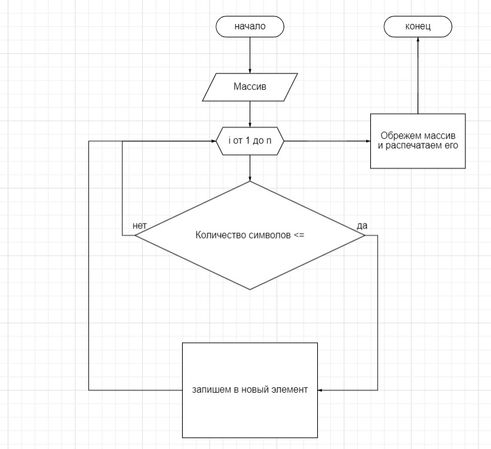

# **`Сделать контрольную работу для выбора специализации в соответствии с заданием`**

# 1. Ссылка на [репозиторий](https://github.com/KrasnovAO/Final-work.git)

# 2.

# 3. Описание программы
   Возьмем массив используем цикл `for` внутри которого применим условие `if (array[i].length (количество символов нашего элемента массива) <= 3)` тогда
   запишем его в `array[j++] = array[i]` затем напечатаем его `Console.Writeline(array[j])`.